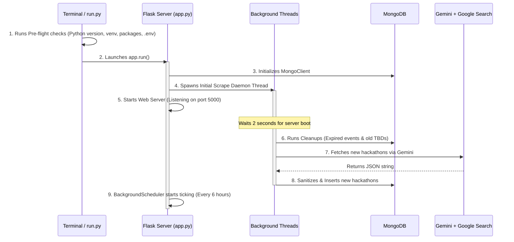

# System Logics & Execution Workflow

This document explains the step-by-step logic of how the Hackathon Harvester runs, fetches data, sanitizes it, and serves it to the user.

---

## 1. Startup & Boot Flow

When you start the application using `python test/run.py` (or directly via `python app.py`), the following sequence occurs:



---

## 2. Dynamic Search & Semantic Scraping Logic

Unlike traditional web scrapers that parse static HTML selectors (which break when a website's layout updates), this application uses **Semantic Web Scraping** via Gemini 2.5 Flash and Google Search tools.

### Query Strategy
The system generates a time-aware prompt based on the server's local time:
```python
current_date = datetime.now()
current_year = current_date.year
next_year = current_year + 1
current_month = current_date.strftime("%B %Y")

# Generates: "latest hackathons 2026 2027 October November December unstop devfolio hackerearth mlh devpost"
query = f"latest hackathons {current_year} {next_year} October November December unstop devfolio hackerearth mlh devpost"
```

### Prompt Engineering Constraints
The LLM is prompted to act as an extraction agent with strict constraints:
1.  **Date Validity**: Deadline must be in the future.
2.  **Strict JSON Format**: Must return only a raw JSON array matching a specified structure.
3.  **Strict URL Format**: Must start with `https://` and point to the actual registration page.

---

## 3. Data Cleansing & Validation Pipeline

Once the LLM returns the raw text, it is processed through a strict ingestion pipeline inside `parse_hackathon_data` in `app.py`:

```
[Raw String]
    │
    ▼
[Clean Markdown] ──► Removes ```json and ``` code block wrappers
    │
    ▼
[Extract JSON] ──► Finds [...] boundaries in the string
    │
    ▼
[Parse List] ──► Converts string to Python dictionaries
    │
    ▼
[Date Validation] ──► Discards hackathons with end_dates in the past
    │
    ▼
[Deduplication] ──► Performs Title, URL, and Similarity matching
    │
    ▼
[DB Insertion] ──► Inserts only brand-new items
```

### The Similarity/Fuzzy Match Logic
To prevent duplicate hackathons listed under slightly different names across different platforms (e.g. *"HackMIT 2026"* on Devpost and *"HackMIT '26"* on MLH), the application runs a similarity check:
1.  It strips all punctuation and spaces from both titles:
    `"HackMIT 2026"` ➔ `"hackmit2026"`
    `"HackMIT '26"` ➔ `"hackmit26"`
2.  If one cleaned title is a substring of another, they are considered potential duplicates.
3.  The pipeline scores both entries based on metadata completeness (e.g. description length and scraping recency).
4.  The entry with the lower score is discarded.

---

## 4. Database Clean-up Routines

To maintain a fast and fresh dashboard, database cleanup routines are executed automatically on **server startup** and **every time a user loads the home page (`/`)**:

*   **Expired Hackathons**: Deletes documents where `end_date` is less than today's date (unless it is `"TBD"`).
*   **Old TBD Events**: Deletes documents where `end_date` is `"TBD"` and `scraped_at` is older than 60 days. This keeps the database from accumulating dead draft entries.

---

## 5. Fallback Google Search Redirection Logic

If a scraper harvests a broken or legacy registration link, the user has a fallback option. When clicking on the "Search" option for a card:
1.  The Flask app handles the request at `/search/<hackathon_id>`.
2.  It looks up the hackathon in MongoDB.
3.  It concatenates the `title`, `platform`, `year`, and terms `"hackathon registration"`.
4.  It URL-encodes the string.
5.  It redirects the user's browser directly to Google:
    ```
    https://www.google.com/search?q=HackMIT+devpost+2026+hackathon+registration
    ```

---

## 6. Troubleshooting Logs (Common Pitfalls)

### A. MongoDB Offline Error
*   **Symptom**: The app runs, but no hackathons are fetched or loaded onto the dashboard.
*   **Why**: The client is configured to connect to `mongodb://localhost:27017/`. If the MongoDB service is not started on Windows, all database queries (such as deletion and queries) timeout (default 30 seconds) and log `ServerSelectionTimeoutError`.
*   **Fix**: Run `Start-Service -Name MongoDB` in administrator PowerShell, or swap the `MONGODB_URI` in `.env` to a MongoDB Atlas cluster.

### B. Unicode Encode Error on Windows Terminal
*   **Symptom**: Running `python test/run.py` or diagnostic scripts crashes with `UnicodeEncodeError: 'charmap' codec can't encode character...`.
*   **Why**: By default, the Windows cmd/PowerShell console uses legacy encodings (like `cp1252`). When the script prints Unicode emojis (like 🔍 or ✅), the terminal fails to render them.
*   **Fix**: Prefix your run command with the environment variable `PYTHONIOENCODING=utf-8`:
    ```powershell
    $env:PYTHONIOENCODING="utf-8"; python test/run.py
    ```