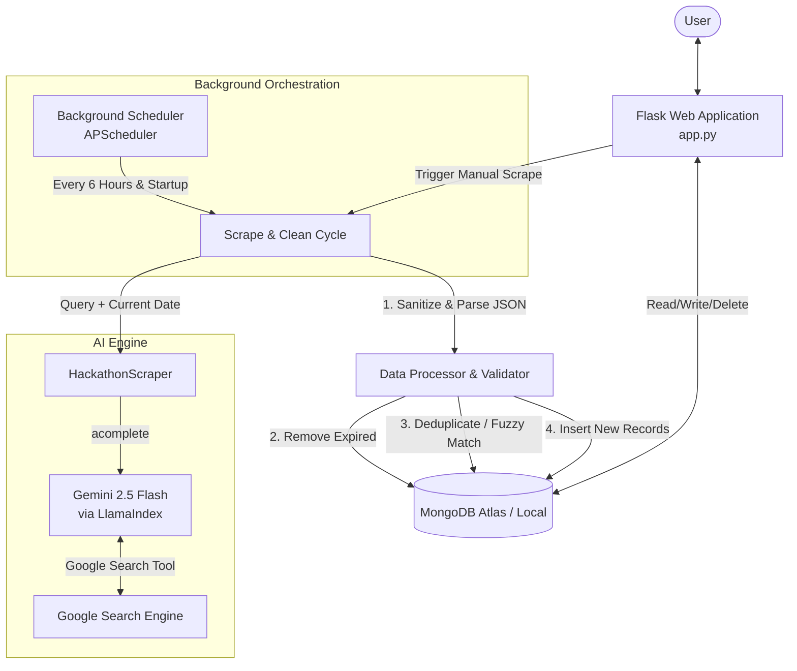

# 🏆 Hackathon Harvester: Architecture & Workflow Guide

Welcome to the technical deep-dive of the **Hackathon Harvester**. This document serves as a comprehensive explanation of how the system orchestrates AI, search engines, a document store, and a web interface to provide a automated hackathon discovery platform.

---

## 📌 High-Level Architecture

The Hackathon Harvester is built on a modern **Flask + MongoDB + LlamaIndex (Gemini 2.5 Flash)** stack. The diagram below details how the various components interact:



---

## ⚙️ Core Technology Stack

1. **Backend Framework**: `Flask (Python)`
   - Serves the HTML frontend using **Jinja2** templates.
   - Exposes RESTful endpoints for CRUD operations and database stats.
   - Runs asynchronous background worker threads for manual and automatic scraping.
2. **AI & Information Retrieval**: `LlamaIndex` & `Google Gemini 2.5 Flash`
   - Integrates `GoogleGenAI` LLM wrapper.
   - Configured with `types.GoogleSearch()` to perform live web queries.
   - Uses robust retry (5x) and high timeout (120s) configs to handle API rate limits.
3. **Database**: `MongoDB`
   - Flexible JSON document store that accommodates varying fields between platforms.
   - Stored in a collection named `hackathons` under `hackathon_db`.
4. **Task Scheduling**: `APScheduler (Advanced Python Scheduler)`
   - Runs a `BackgroundScheduler` to automatically run scraping and database cleaning in the background without locking the Flask event loop.
5. **Styling & UI**: `Primer CSS (GitHub Docs Theme)` + `Custom CSS`
   - Provides a clean, accessibility-compliant, documentation-style dashboard.
   - Supports light and dark mode automatically based on client system settings.

---

## 🛠️ Detailed Component Analysis

### 1. The AI-Powered Scraper (`HackathonScraper`)
Located in `app.py`, the scraper does not rely on static web scrapers (which break whenever website HTML structures change). Instead, it uses **Semantic Scraping**:

*   **Dynamic Query Formulation**: Automatically appends the current date, year, and target months to direct Gemini to current and upcoming hackathons:
    ```python
    query = f"latest hackathons {current_year} {next_year} October November December unstop devfolio hackerearth mlh devpost"
    ```
*   **Prompt Constraints**: Instructs the LLM to output *strictly* raw JSON data in a specified schema, filter out past deadlines, ensure URLs start with `https://`, and omit any conversational markdown wrapping.
*   **API Resilience**: Implements an exponential backoff retry loop (10s, 20s, 30s) up to 3 times to manage network hiccups or API rate limits.

### 2. Scraping, Clean-up, and Deduplication Pipeline
When a scraping cycle is executed, it runs through the following sequence:

```
[Fetch Raw String] ➔ [Clean Markdown Wrappers] ➔ [Parse JSON List]
        ➔ [Date Validation] ➔ [Deduplication] ➔ [Fuzzy Matching] ➔ [Insert]
```

#### A. JSON Parsing & Extraction
The LLM response is cleaned by removing markdown identifiers (` ```json ` or ` ``` `) and finding the outermost `[...]` boundaries, converting the text into a Python list of dictionaries.

#### B. Date Validation
*   Dates are evaluated. If a hackathon's `end_date` is in the past (compared to the server's current date), it is filtered out.
*   If `end_date` is `TBD`, it is allowed but marked with a 60-day expiry limit in the database.

#### C. Multi-Stage Deduplication
Before inserting records into MongoDB, the application runs three deduplication checks:
1.  **Exact Title Match**: Case-insensitive comparison. If a title already exists, the database retains the entry with the newer `scraped_at` timestamp.
2.  **Exact URL Match**: Direct match on the `website_url` field.
3.  **Fuzzy String Matching (Title Similarity)**:
    - Removes all special characters and spaces to create comparative slugs.
    - If one title is a substring of another (e.g., *"HackMIT 2026"* vs. *"HackMIT 2026 - Registration"*), they are flagged.
    - The code calculates a quality score based on description length and scraping recency, discarding the lower-scoring duplicate.

#### D. Database Clean-up
*   **Expired Hackathons**: Old events are automatically deleted every time the home page is loaded, or when the scheduler ticks.
*   **Old TBD Events**: TBD events that have been in the database for over 60 days are removed to keep the database fresh.

### 3. Background Scheduling & Threading
To prevent the Flask application from blocking or timing out during web-scraping cycles (which can take 10-30 seconds), the application makes heavy use of multi-threading:
*   **Startup Scrape**: Initiated in a daemonized background `Thread` when `app.py` boots.
*   **Scheduled Scrape**: A `BackgroundScheduler` triggers `automatic_scrape` every 6 hours.
*   **Manual Trigger (`/api/scrape-now`)**: Launches a new, isolated background thread to trigger the scrape immediately, returning an instant JSON response to the user indicating that the background task is running.

---

## 🗃️ MongoDB Data Schema

Each document in the `hackathons` collection follows this JSON schema:

```json
{
  "_id": "ObjectId",
  "title": "Full Official Hackathon Name",
  "description": "Comprehensive description including themes, tracks, and key details.",
  "organizer": "Name of the organizing body (e.g., Major League Hacking)",
  "registration_deadline": "YYYY-MM-DD",
  "event_date": "YYYY-MM-DD",
  "prize_pool": "$10,000 / ₹50,000 / TBD",
  "website_url": "https://official-hackathon-url.com/register",
  "platform": "unstop | devfolio | hackerearth | mlh | devpost | other",
  "status": "open | closed | upcoming",
  "tags": ["AI/ML", "Web3", "Beginner Friendly"],
  "eligibility": "Students / Professionals / Open to all",
  "scraped_at": "ISODate('2026-06-09T16:12:00Z')",
  "source": "gemini_search",
  "updated_at": "ISODate('2026-06-09T16:12:00Z')"
}
```

---

## 🔍 Interactive Redirection Feature
A unique feature is the dynamic search redirect endpoint `/search/<hackathon_id>`:
1.  When clicked, the backend looks up the hackathon details.
2.  It extracts the `title`, `platform`, and current `year` (e.g., `["Buildathon", "devfolio", "2026"]`).
3.  It joins and URL-encodes these keywords into a search query.
4.  The user is redirected directly to a Google Search page: `https://www.google.com/search?q=Buildathon+devfolio+2026+hackathon+registration`.
5.  This serves as an instant fallback search in case the stored registration URL is outdated or broken.

---

## 🧪 Prototyping, Testing & Diagnostic Utilities

The codebase includes several utility files that allow you to interact with the core logic without launching the full web server:

### 1. `scrapper/scrapper.ipynb`
A Jupyter notebook used during the initial prototyping phase. It explores:
*   LlamaIndex LLM client configuration.
*   Integrating Google Generative AI search tools.
*   Setting up structured custom agents using LlamaIndex's `AgentWorkflow` multi-agent workflows.

### 2. `test/test_api.py`
A diagnostic script that makes a standalone, direct API request to Gemini 2.5 Flash with the Search tool, outputs raw LLM responses, and details exactly how formatting filters clean up and parse JSON.

### 3. `test/test_scraper.py`
An asynchronous script that runs the `HackathonScraper` class, validates results, and outputs a local file `test/scraper_test_output.json` for quality control.

### 4. `test/database_cleanup.py`
A terminal-based CLI dashboard for MongoDB administration:
*   Allows you to analyze current document statistics (active count, expired count, TBD counts).
*   Gives breakdown stats by platform and status.
*   Provides manual controls to trigger exact/fuzzy deduplication and expired-entry cleanups.

### 5. `test/run.py`
An application launcher wrapper that performs pre-flight checks:
*   Verifies Python version is `>= 3.8`.
*   Checks if a Python virtual environment (`venv`) is active.
*   Validates that all required modules are installed (`flask`, `pymongo`, `python-dotenv`, `llama-index`, etc.).
*   Ensures a `.env` file exists with actual API credentials rather than placeholders.
*   Launches the Flask development server on success.
